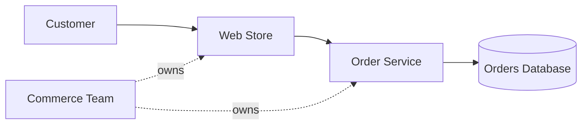

# Simple Order System

The Web Store calls the Order Service when a customer places or views an order. The Order Service
uses the Orders Database to save and retrieve orders. The Commerce Team owns both services.

