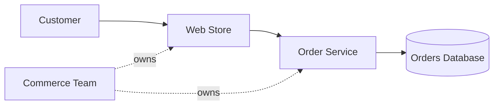

# Simple Order System

This example describes a small system for placing and viewing orders. It is designed for a quick
Graphify extraction with few entities and unambiguous relationships.

## Entities

| Type | Name | Purpose |
|---|---|---|
| `Service` | `Web Store` | Accepts customer requests |
| `Service` | `Order Service` | Creates and retrieves orders |
| `Database` | `Orders Database` | Stores order records |
| `Team` | `Commerce Team` | Develops and operates the system |

## Relationships

| Type | Source | Target |
|---|---|---|
| `CALLS` | `Web Store` | `Order Service` |
| `USES_DATABASE` | `Order Service` | `Orders Database` |
| `OWNED_BY` | `Web Store` | `Commerce Team` |
| `OWNED_BY` | `Order Service` | `Commerce Team` |

The Web Store calls the Order Service when a customer places or views an order. The Order Service
uses the Orders Database to save and retrieve orders. The Commerce Team owns both services.

## Extraction checks

After extraction, the graph should answer these questions:

1. Which service uses the Orders Database?
2. What does the Web Store call?
3. Which team owns the Order Service?
