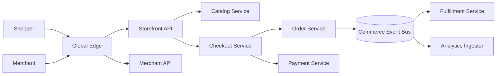
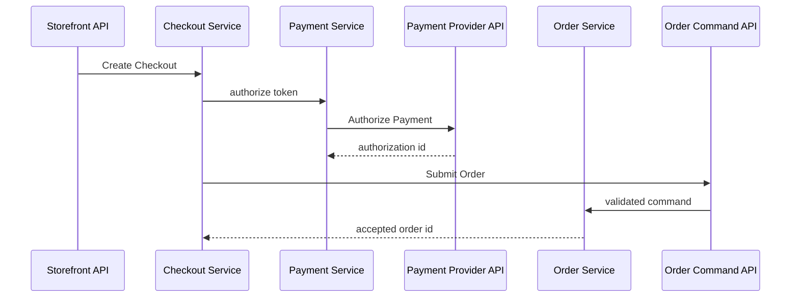
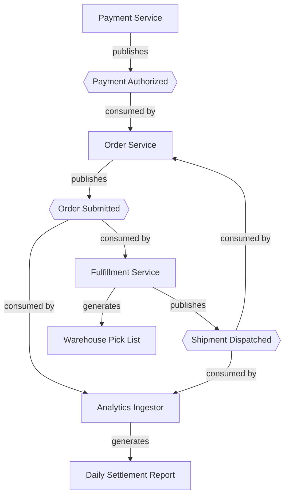
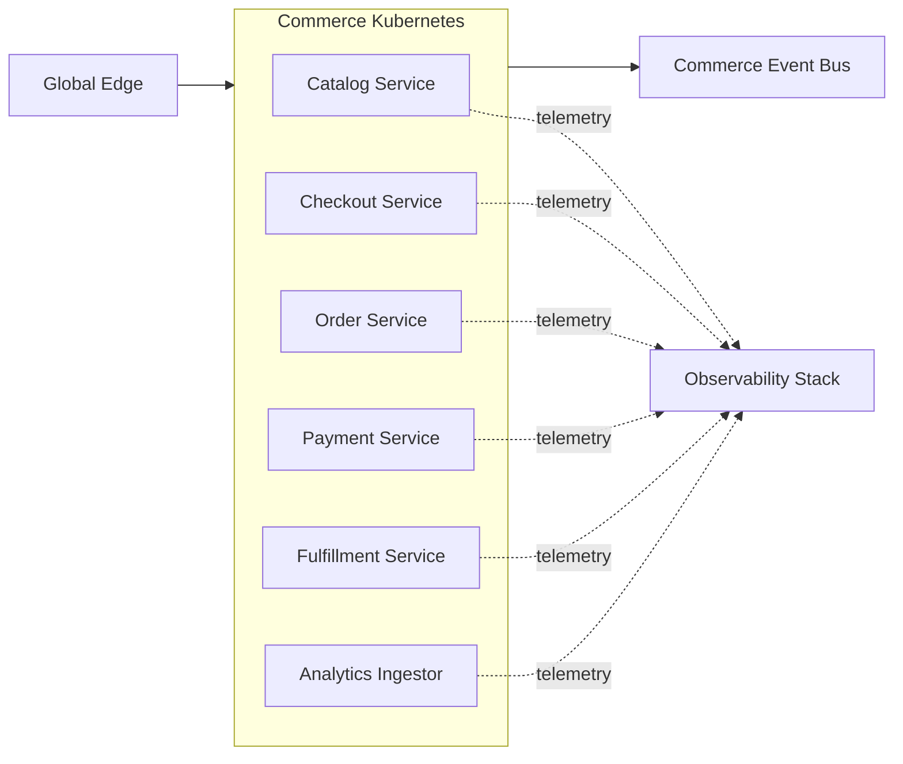

# Atlas Commerce Platform

This document describes a fictional multi-region commerce platform. It is intentionally detailed:
it is sample input for testing architecture graph extraction, relationship provenance, aliases, and
multi-hop queries. Names in backticks are canonical names. Earlier documents may use the aliases
listed below.

## System context

Atlas serves shoppers, merchants, warehouse operators, and finance analysts. Public traffic enters
through the Global Edge, while internal services communicate through APIs and events. The platform
uses an active-active application topology, but each order has one home region to serialize writes.

## Canonical entity inventory

The inventory deliberately covers all supported Graphify entity types.

| Type | Canonical name | Aliases | Responsibility |
|---|---|---|---|
| `Service` | `Catalog Service` | Product Catalog, Catalog | Product descriptions, prices, and availability views |
| `Service` | `Checkout Service` | Checkout | Checkout orchestration and idempotency |
| `Service` | `Order Service` | OMS, Orders | Order lifecycle and home-region write ownership |
| `Service` | `Payment Service` | Payments | Payment authorization and capture orchestration |
| `Service` | `Fulfillment Service` | WMS Adapter, Fulfillment | Warehouse routing and shipment state |
| `Service` | `Analytics Ingestor` | Commerce ETL | Event ingestion for analytics |
| `API` | `Storefront API` | Shop API | Public shopper interface |
| `API` | `Merchant API` | Seller API | Merchant catalog and order-management interface |
| `API` | `Order Command API` | Orders Write API | Internal order mutation interface |
| `API` | `Payment Provider API` | Acquirer API | External payment-provider interface |
| `Endpoint` | `Get Product` | GET product | Reads a product detail view |
| `Endpoint` | `Create Checkout` | POST checkout | Starts an idempotent checkout |
| `Endpoint` | `Submit Order` | POST order | Creates an order from a confirmed checkout |
| `Endpoint` | `Authorize Payment` | POST authorization | Requests a provider authorization |
| `Database` | `Catalog PostgreSQL` | catalog-db | Authoritative catalog records |
| `Database` | `Checkout Redis` | checkout-cache | Ephemeral checkout state and idempotency keys |
| `Database` | `Orders PostgreSQL` | orders-db, OMS database | Orders and order state transitions |
| `Database` | `Payments Vault` | payment-token-store | Tokenized payment references; no raw card data |
| `Database` | `Commerce Warehouse` | analytics-warehouse | Curated commerce analytics data |
| `Event` | `Order Submitted` | order.submitted.v2 | Immutable order-acceptance event |
| `Event` | `Payment Authorized` | payment.authorized.v1 | Successful payment authorization event |
| `Event` | `Shipment Dispatched` | shipment.dispatched.v1 | Shipment handoff event |
| `Team` | `Shopping Experience Team` | Shopping XP | Storefront and checkout ownership |
| `Team` | `Order Platform Team` | Orders Team | Order lifecycle ownership |
| `Team` | `Money Movement Team` | Payments Team | Payment integration ownership |
| `Team` | `Supply Chain Team` | Fulfillment Team | Warehouse and shipment ownership |
| `Team` | `Data Platform Team` | Data Team | Analytics ingestion and warehouse ownership |
| `Document` | `Order Lifecycle Runbook` | OMS runbook | Operational procedures for stuck orders |
| `Document` | `Daily Settlement Report` | settlement CSV | Daily reconciliation output |
| `Document` | `Warehouse Pick List` | pick-list PDF | Per-warehouse picking instructions |
| `Infrastructure` | `Global Edge` | edge gateway | TLS termination, WAF, and regional routing |
| `Infrastructure` | `Commerce Kubernetes` | commerce-k8s | Regional application runtime |
| `Infrastructure` | `Commerce Event Bus` | commerce-events | Replicated event transport |
| `Infrastructure` | `Observability Stack` | telemetry platform | Metrics, logs, traces, and alert routing |

## API surface and synchronous request path

The `Global Edge` routes public requests to the `Storefront API` and `Merchant API`. The
`Storefront API` exposes `Get Product` and `Create Checkout`. The `Order Command API` exposes
`Submit Order`. The external `Payment Provider API` exposes `Authorize Payment`.

During product browsing, `Storefront API` calls `Catalog Service`; `Catalog Service` uses
`Catalog PostgreSQL`. During checkout, `Storefront API` calls `Checkout Service`.
`Checkout Service` uses `Checkout Redis`, calls `Order Service`, and calls `Payment Service`.
`Order Service` receives commands through `Order Command API` and uses `Orders PostgreSQL`.
`Payment Service` calls `Payment Provider API`, which receives the `Authorize Payment` request.
`Payment Service` stores only provider tokens in `Payments Vault`.

## Event-driven fulfillment and analytics

After committing an order, `Order Service` publishes `Order Submitted` to the
`Commerce Event Bus`. Both `Fulfillment Service` and `Analytics Ingestor` consume
`Order Submitted` independently.

When authorization succeeds, `Payment Service` publishes `Payment Authorized` to the
`Commerce Event Bus`. `Order Service` consumes `Payment Authorized` and advances the matching
order without making another synchronous payment call.

`Fulfillment Service` generates `Warehouse Pick List` documents for warehouse operators. After a
carrier handoff, `Fulfillment Service` publishes `Shipment Dispatched`. `Order Service` consumes
that event to update customer-visible status, and `Analytics Ingestor` consumes it for delivery
metrics. `Analytics Ingestor` uses `Commerce Warehouse` and generates the
`Daily Settlement Report`. The finance analysts receive the report through their existing secure
report channel; that human channel is outside this architecture graph.

Delivery is at least once. Consumers deduplicate by event ID. Event schema evolution is backward
compatible within a major version; therefore `order.submitted.v2` is an alias of the canonical
`Order Submitted` event, not a second event.

## Deployment, ownership, and operational dependencies

`Catalog Service`, `Checkout Service`, `Order Service`, `Payment Service`, `Fulfillment Service`,
and `Analytics Ingestor` are deployed to `Commerce Kubernetes`. All six services depend on the
`Observability Stack` for production telemetry. `Commerce Kubernetes` depends on `Global Edge`
for ingress routing and on `Commerce Event Bus` for asynchronous transport.

`Shopping Experience Team` owns `Catalog Service`, `Checkout Service`, and `Storefront API`.
`Order Platform Team` owns `Order Service`, `Order Command API`, and `Orders PostgreSQL`.
`Money Movement Team` owns `Payment Service`, `Payments Vault`, and the integration with
`Payment Provider API`. `Supply Chain Team` owns `Fulfillment Service`. `Data Platform Team` owns
`Analytics Ingestor` and `Commerce Warehouse`.

`Order Service` is described in `Order Lifecycle Runbook`. The runbook depends on the
`Observability Stack` because every diagnostic procedure starts from a trace or alert.

## Explicit relationship ledger

This ledger removes diagram-direction ambiguity and supplies positive examples of every supported
relationship. Repeated facts are intentional: prose, diagrams, and the ledger should converge on
the same graph rather than produce duplicate nodes.

| Relationship | Source | Target |
|---|---|---|
| `CALLS` | `Storefront API` | `Catalog Service` |
| `CALLS` | `Storefront API` | `Checkout Service` |
| `CALLS` | `Checkout Service` | `Order Service` |
| `CALLS` | `Checkout Service` | `Payment Service` |
| `CALLS` | `Payment Service` | `Payment Provider API` |
| `USES_DATABASE` | `Catalog Service` | `Catalog PostgreSQL` |
| `USES_DATABASE` | `Checkout Service` | `Checkout Redis` |
| `USES_DATABASE` | `Order Service` | `Orders PostgreSQL` |
| `USES_DATABASE` | `Payment Service` | `Payments Vault` |
| `USES_DATABASE` | `Analytics Ingestor` | `Commerce Warehouse` |
| `PUBLISHES` | `Order Service` | `Order Submitted` |
| `PUBLISHES` | `Payment Service` | `Payment Authorized` |
| `PUBLISHES` | `Fulfillment Service` | `Shipment Dispatched` |
| `CONSUMES` | `Fulfillment Service` | `Order Submitted` |
| `CONSUMES` | `Analytics Ingestor` | `Order Submitted` |
| `CONSUMES` | `Order Service` | `Payment Authorized` |
| `CONSUMES` | `Order Service` | `Shipment Dispatched` |
| `CONSUMES` | `Analytics Ingestor` | `Shipment Dispatched` |
| `DEPLOYED_TO` | `Order Service` | `Commerce Kubernetes` |
| `OWNED_BY` | `Order Service` | `Order Platform Team` |
| `DESCRIBED_IN` | `Order Service` | `Order Lifecycle Runbook` |
| `DEPENDS_ON` | `Order Lifecycle Runbook` | `Observability Stack` |
| `EXPOSES` | `Storefront API` | `Get Product` |
| `EXPOSES` | `Storefront API` | `Create Checkout` |
| `EXPOSES` | `Order Command API` | `Submit Order` |
| `EXPOSES` | `Payment Provider API` | `Authorize Payment` |
| `GENERATES` | `Fulfillment Service` | `Warehouse Pick List` |
| `GENERATES` | `Analytics Ingestor` | `Daily Settlement Report` |
| `RECEIVES` | `Payment Provider API` | `Authorize Payment` |

## Failure boundaries and invariants

- Checkout retries reuse the same idempotency key in `Checkout Redis`; a timeout must not create a
  second order.
- A payment-provider outage blocks new authorizations but does not block catalog browsing or
  shipment-event processing.
- `Orders PostgreSQL` is authoritative for order state. Events are integration records, not an
  alternative order database.
- `Commerce Warehouse` may lag operational systems by fifteen minutes and must never serve the
  customer-facing order-status path.
- Raw card data never enters `Payment Service`, `Payments Vault`, the event bus, logs, or reports.
- Loss of the `Observability Stack` degrades diagnosis and alerting but does not change transaction
  correctness.

## Extraction test questions

After building a graph from this directory, these questions should exercise useful traversals:

1. Which team owns the service that uses `Orders PostgreSQL`?
2. What is affected if `Commerce Event Bus` is unavailable?
3. Find a path from `Storefront API` to `Payment Provider API`.
4. Which services consume events published by `Fulfillment Service`?
5. Which document is generated by the service that uses `Commerce Warehouse`?
6. Which infrastructure dependencies support the `Order Lifecycle Runbook`?
7. Do `OMS`, `Orders`, and `Order Service` normalize to one service rather than three entities?

